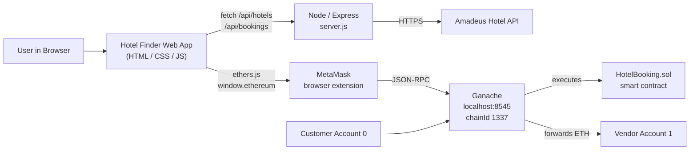
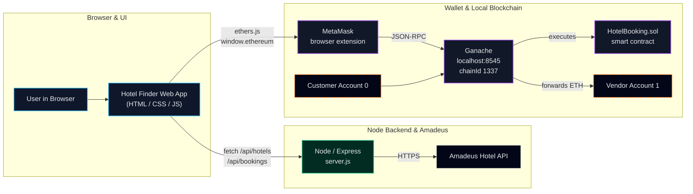

# Globotour

Globotour is a web application that allows users to search for hotels, view offers and explore nearby experiences and book a hotel using a blockchain-powered wallet system. The application is currently a working prototype, integrating a local ganache network and MetaMask to handle payments on a simulated Ethereum network.

# DEPENDENCIES AND SETUP
## Node

Node.js and NPM are used to run this web application, with additional required services and packages. 

1. Clone this Repo
2. With Node and NPM installed, run:

```
npm install
```

With the node packages installed, we can setup the API credentials.

## API

Amadeus API is used to power the API calls for GloboTour. You will need to supply your own API Key and Secret. Create a .env file in the root of the project and add:  

- AMADEUS_CLIENT_ID=YOUR_KEY

- AMADEUS_CLIENT_SECRET=YOUR_SECRET

Amadeus is used to query hotels via citycode, hotel offers using that city code with user inputed check-in, check-out and guest numbers and third api call that fetches experiences within the vicinity of the user selected hotel.

## Blockchain

For this prototype, Ganache and MetaMask have been used in conjunction to simulate a local blockchain for testing purposes. 

1. Install both Ganache and MetaMask via their websites.
2. Create a new workspace inside Ganache which will create 10 accounts for us to use.
3. Use
```
truffle compile
```
```
truffle migrate --reset
```

to deploy the smart contract.

4. From the terminal, take the contract address and insert it into blockchain.js:
-const HOTEL_BOOKING_ADDRESS = "INSERT BOOKING ADDRESS"

5. Run the project from the root directory using:
```
npm run devStart
```
6. At checkout, you will be prompted to connect your wallet via MetaMask.
-Add the local Ganache network in MetaMask
-Add an account using one of the private keys from Ganache's accounts screen






